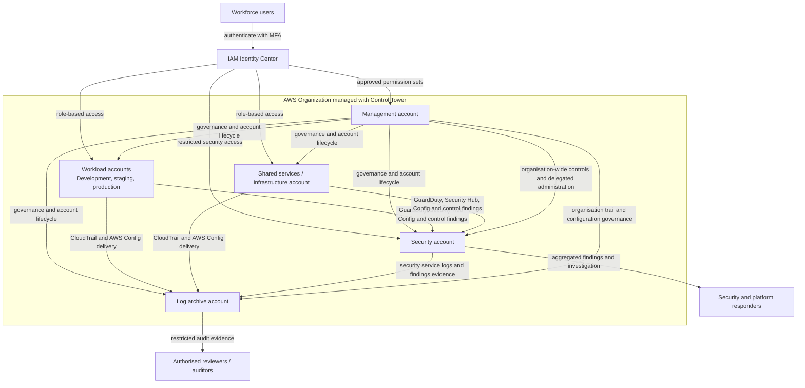

# Governance Baseline Architecture

This diagram shows the intended high-level relationships in the public AWS Control Tower reference pattern. It is illustrative only: account names, organisational units, regions, delegated administrators, retention settings, network boundaries, and permission sets must be adapted and reviewed for each organisation.

## Multi-Account Layout

## Account Responsibilities

| Account or area | Primary responsibility |
| --- | --- |
| Management | AWS Organizations, Control Tower administration, account lifecycle, and organisation-wide governance |
| Security | Delegated administration, findings aggregation, investigation, and security tooling |
| Log archive | Restricted central storage for CloudTrail, AWS Config, and other approved audit evidence |
| Shared services / infrastructure | Shared networking, DNS, CI/CD support, observability, and other centrally operated services |
| Workload accounts | Isolated development, staging, production, and application-specific resources |
| IAM Identity Center | Workforce authentication and assignment of reviewed permission sets to approved accounts |

## Logging Flow

The baseline expects workload and shared-services accounts to send organisation-wide audit and configuration evidence to the log archive account. Security services aggregate findings in the security account so responders can investigate without granting broad access to workload accounts.

A real implementation should define and test:

- enabled regions and any documented exclusions;
- organisation trail and AWS Config coverage;
- encryption, lifecycle, retention, versioning, and deletion protection;
- access monitoring for the log archive;
- delegated administrator assignments;
- alerting for disabled controls, delivery failures, and configuration drift;
- evidence ownership and periodic review.

## Access Flow

Human access should use IAM Identity Center and reviewed permission sets rather than long-lived IAM users. Privileged access should be limited, approved, time-bounded where possible, monitored, and included in regular access reviews.

Break-glass access is intentionally not shown as a normal access path. It should remain separately controlled, monitored, tested, and documented using the [break-glass drill guide](break-glass-drill.md).

## Boundaries and Limitations

This diagram does not define VPC topology, service control policies, exact Control Tower controls, backup architecture, incident response procedures, or production-ready Terraform. Use it to explain governance relationships, then validate the detailed design against the organisation's security, compliance, resilience, and operational requirements.
